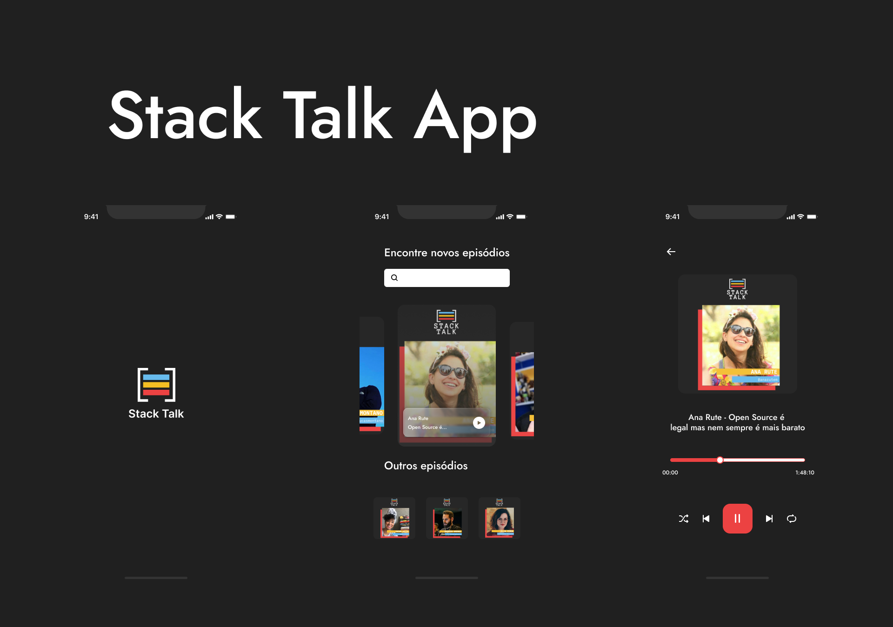

<div align='center'>
	
	<h1>Stack Talk App</h1>
	<p>Aplicativo não oficial do podcast Stack Talk apresentado por Bruno Germano com desenvolvedores incríveis</p>
  <a href="./README.md">Inglês |</a>
  <a href="./PORTUGUESE.md">Português</a>
</div>

## 🤔 Inspiração

Minha inspiração vem da necessidade de ouvir os episódios de Stack Talk, mas não gosto de ouvir no YouTube ou outras plataformas, então decidi criar um aplicativo para reproduzir esses episódios.
A plataforma <a href='https://anchor.fm/stack-talk'> Anchor.fm </a> tem um serviço RSS, então usei esse serviço para usar no aplicativo.

## 👾 Tecnologias

- React Native 
- TypeScript
- React Navigation
- Axios
- React Native Vector Icons
- React Native Track Player

## 👨‍💻 Como usar

Para executar este aplicativo, você precisa clonar o repositório e instalar todas as dependências do aplicativo móvel e do servidor.

### Rodar o app:
```bash
## Clone o repositório
git clone https://github.com/Guigalaverna/stack-talk-app && cd stack-talk-app

## Instale as dependências do app e execute o aplicativo
cd mobile && npm install && npm run android
```
***Em um outro terminal***

### Rodar o servidor:
```bash
## Instale as dependências do servidor e execute o servidor
cd server && npm install && npm run dev
```

## 🤝 Contribuindo

Se você deseja contribuir com este projeto, siga estas etapas:

1. Crie um Fork deste repositório
2. Crie suas features
3. Envie para o seu repositório
4. Crie uma pull request

E se este projeto o ajudou de alguma forma, considere dar ao projeto uma estrela ⭐

## 🖖 Agradecimentos

Um grande obrigado a essas pessoas incríveis

<table align="center">
  <tr>
    <td align="center"><a href="https://github.com/egermano"><br /><sub><b>Bruno Germano</b></sub></a><br /><a href="https://github.com/egermano" title="Bruno Germano"></a></td>
    <td align="center"><a href="https://github.com/yansena"><br /><sub><b>Yan Sena</b></sub></a><br /><a href="https://github.com/yansena" title="Yan Sena"></a></td>
  </tr>
</table>