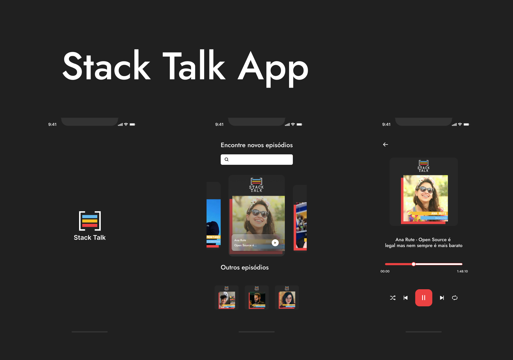

<div align='center'>
	
	<h1>Stack Talk App</h1>
	<p>Unofficial application of the Stack Talk podcast presented by Bruno Germano with incredible devs</p>
	<a href='./README.md'>English |</a>
	<a href='./PORTUGUESE.md'>Portuguese</a>
</div>

## 🤔 Inspiration

My inspiration comes from the need to listen to the episodes of Stack Talk, but I don't like to listen on YouTube or other platforms, so I decided to create an app to play these episodes, the 
<a href='https://anchor.fm/stack-talk'>Anchor.fm</a> platform has an RSS service, so I used this service to use in the app.

## 👾 Technologies

- React Native 
- TypeScript
- React Navigation
- Axios
- React Native Vector Icons
- React Native Track Player

## 👨‍💻 How to Use

To run this app, you need to clone the repository and install all the dependencies of the mobile app and the server.

### Run mobile:
```bash
## Clone the repository
git clone https://github.com/Guigalaverna/stack-talk-app && cd stack-talk-app

## Install mobile dependencies and run the app
cd mobile && npm install && npm run android
```
***In another terminal***

### Run server:
```bash
## Install server dependencies
cd server && npm install && npm run dev
```

## 🤝 Contributing

If you want to contribute to this project, follow these steps:

1. Fork this repository
2. Create your features
3. Push to your repository
4. Create a pull request

And if this project helped you in any way, consider giving the project a star ⭐

## 🖖 Acknowledgments

A big thanks to these amazing people

<table align="center">
  <tr>
    <td align="center"><a href="https://github.com/egermano"><br /><sub><b>Bruno Germano</b></sub></a><br /><a href="https://github.com/egermano" title="Bruno Germano"></a></td>
    <td align="center"><a href="https://github.com/yansena"><br /><sub><b>Yan Sena</b></sub></a><br /><a href="https://github.com/yansena" title="Yan Sena"></a></td>
  </tr>
</table>
